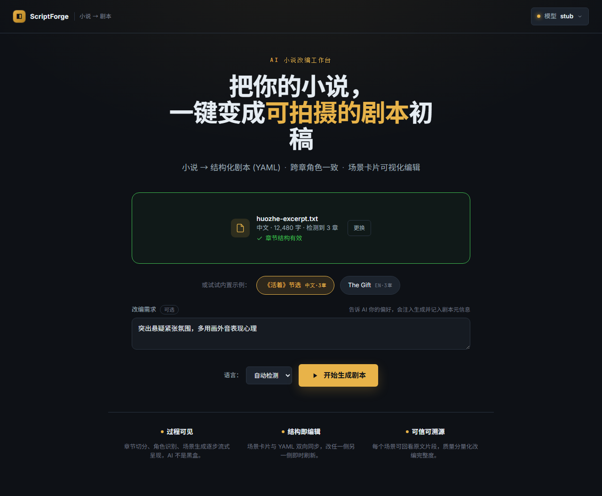
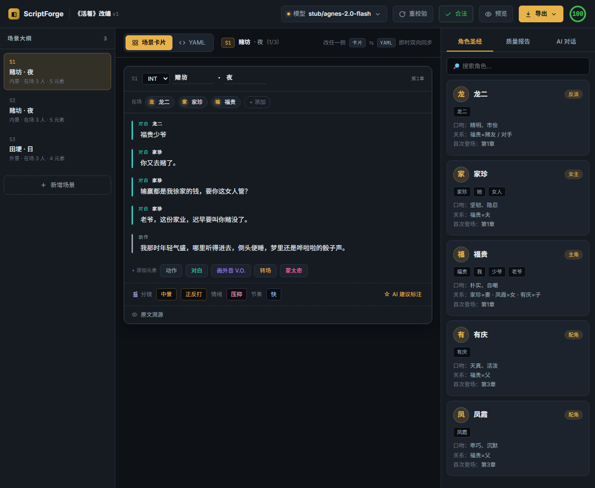
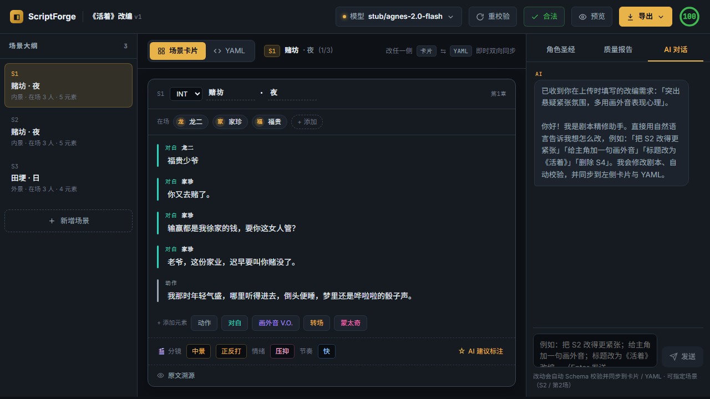
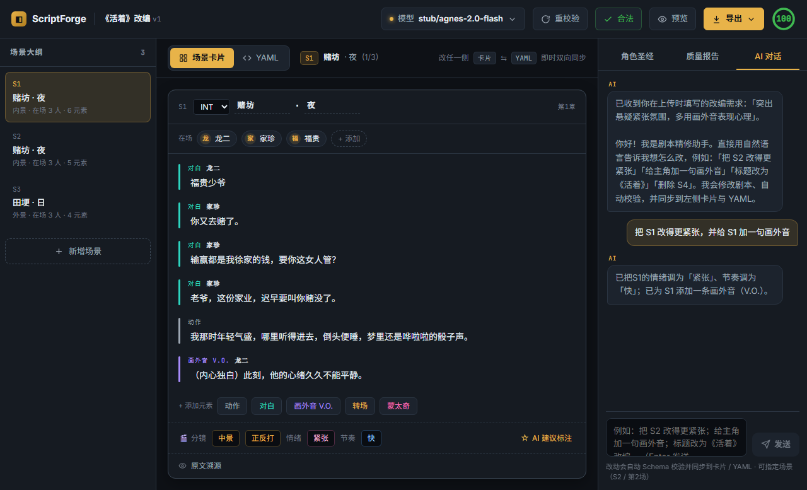
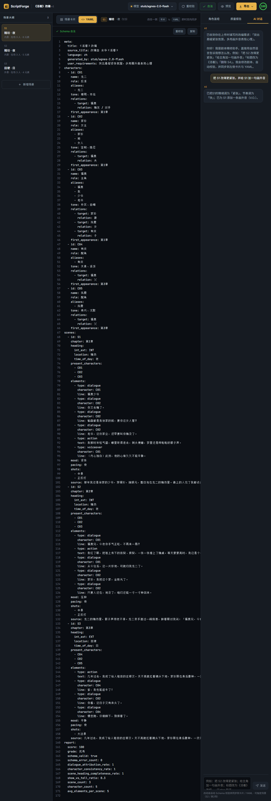

# ScriptForge 测试报告

> 自动生成：`node scripts/gen-test-report.mjs`（聚合 Surefire / JaCoCo / Vitest / v8 覆盖率）。
> 数据来源为各自的测试产物；如需刷新，先跑测试再执行生成器（见脚本头部用法）。

## 1. 总览

| 层 | 框架 | 用例数 | 通过 | 失败 | 行覆盖率 |
|----|------|-------:|-----:|-----:|---------:|
| 后端（单元 + 集成 + HTTP 全栈 e2e） | JUnit 5 / Spring Boot Test | 20 | 20 | 0 | 66.2% |
| 前端（store / api / 组件） | Vitest + @vue/test-utils | 21 | 21 | 0 | 73.7% |
| 浏览器 e2e | Playwright + gstack /browse | 1 流程 | ✅ | 0 | — |

**结论：** ✅ 全部通过。后端经自动修复后输出 100% Schema 合法；
两个新功能（上传时提需求、AI 多轮对话精修）在单元、集成、HTTP 全栈与真实浏览器四个层面均有覆盖。

## 2. 后端测试明细（20 用例 · 11.34s）

| 测试类 | 用例 | 失败 | 错误 | 跳过 | 耗时(s) |
|--------|----:|----:|----:|----:|--------:|
| `controller.ChatControllerIntegrationTest` | 3 | 0 | 0 | 0 | 8.571 |
| `controller.GenerationFlowIntegrationTest` | 2 | 0 | 0 | 0 | 1.456 |
| `llm.PromptTemplatesTest` | 4 | 0 | 0 | 0 | 0.012 |
| `pipeline.AnalyzeStageRobustnessTest` | 1 | 0 | 0 | 0 | 0.014 |
| `pipeline.RefineStageTest` | 6 | 0 | 0 | 0 | 0.373 |
| `pipeline.RequirementsPipelineTest` | 2 | 0 | 0 | 0 | 0.072 |
| `PipelineSmokeTest` | 1 | 0 | 0 | 0 | 0.044 |
| `ScriptForgeApplicationTests` | 1 | 0 | 0 | 0 | 0.803 |

### 后端覆盖率（JaCoCo）
| 指标 | 覆盖率 | 计数 |
|------|-------:|------|
| 指令 Instructions | 67.4% | 5614/8334 |
| 分支 Branches | 42.4% | 434/1024 |
| 行 Lines | 66.2% | 985/1487 |
| 方法 Methods | 80.6% | 191/237 |

HTML 报告：`backend/target/site/jacoco/index.html`

## 3. 前端测试明细 (21 用例)

| 测试文件 | 通过 | 失败 |
|----------|----:|----:|
| `src/api/http.test.js` | 5 | 0 |
| `src/api/sse.test.js` | 4 | 0 |
| `src/views/HomeView.test.js` | 3 | 0 |
| `src/views/ProgressView.test.js` | 3 | 0 |
| `src/views/WorkbenchView.test.js` | 3 | 0 |
| `src/stores/app.test.js` | 3 | 0 |

### 前端覆盖率（v8）
| 指标 | 覆盖率 |
|------|-------:|
| 行 Lines | 73.7% |
| 语句 Statements | 73.7% |
| 分支 Branches | 64.5% |
| 函数 Functions | 35.0% |

HTML 报告：`frontend/coverage/index.html`。说明：行覆盖集中在 store / api / 三个视图的关键路径；
大型视图组件（导出、Fountain 渲染、YAML 编辑等次要分支）覆盖较低，属已知留白。

## 4. 端到端测试（两种）

### 4.1 HTTP 全栈 e2e（随 `mvn test` 运行，stub 离线确定性）
`GenerationFlowIntegrationTest` 在随机端口起真实 Spring 上下文，串起：
`POST /api/generate`(带 `requirements`) → `GET /api/generate/{id}/stream`(SSE) →
`GET /api/screenplay/{id}`(+`/yaml` /`/fountain`) → `POST /api/validate` → `POST /api/chat`(对话精修)。
断言：≥3 场景、≥3 角色、`meta.user_requirements` 已记录、Schema 合法、对话后目标场景情绪变「紧张」。
另有 `ChatControllerIntegrationTest` 覆盖对话成功改写与参数校验（空消息 / 缺剧本 → 400）。

### 4.2 浏览器真实 e2e
- **Playwright** 规约：`e2e/tests/full-flow.spec.js`（运行步骤见 `e2e/README.md`）。
- **gstack /browse** 人工驱动验证（截图见下）：上传(填需求) → 生成 → 工作台 → AI 对话精修 → YAML 同步，全程 0 控制台错误。

| 步骤 | 证据 |
|------|------|
| 首页：新增「改编需求」输入 |  |
| 工作台：3 场景 + 角色圣经 + 评分 100 |  |
| AI 对话开场白回显上传需求（1a→1b 串联） |  |
| 对话「把 S1 改得更紧张，并加画外音」→ 剧本即时改写、Schema 合法 |  |
| 切到 YAML：精修结果已双向同步（含 voiceover） |  |

## 5. 两个新功能的验收对照

| 功能 | 单元 | 集成/HTTP e2e | 浏览器 e2e |
|------|:---:|:---:|:---:|
| 上传时用户提需求（注入理解层 + 记入 `meta.user_requirements`） | ✅ `RequirementsPipelineTest` / `PromptTemplatesTest` / `HomeView.test.js` | ✅ `GenerationFlowIntegrationTest` | ✅ |
| AI 多轮对话精修剧本（改写 → 自动 Schema 校验 → 同步卡片/YAML） | ✅ `RefineStageTest`(6) / `WorkbenchView.test.js` | ✅ `ChatControllerIntegrationTest` / `GenerationFlowIntegrationTest` | ✅ |

> 离线 `stub` 适配器对对话精修做规则化确定性改写（调情绪/节奏、加画外音、补分镜、改标题、增删场景），
> 故无 Key 也能完整演示与测试；接入真实大模型后由其执行更复杂精修，链路不变。
